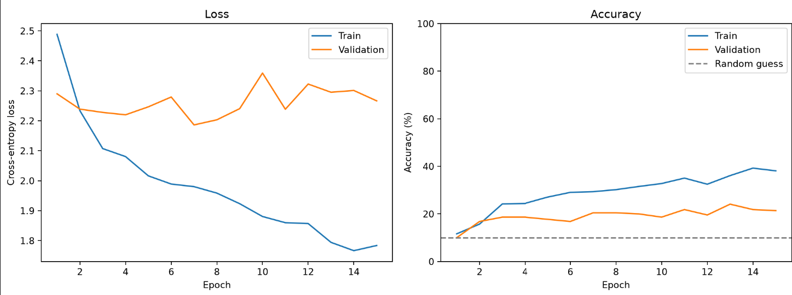
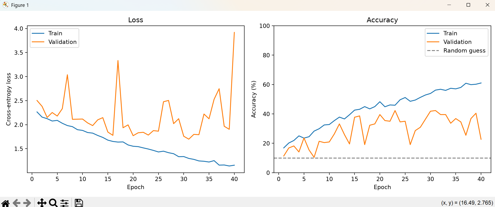
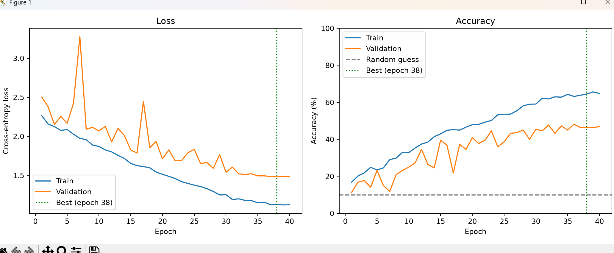
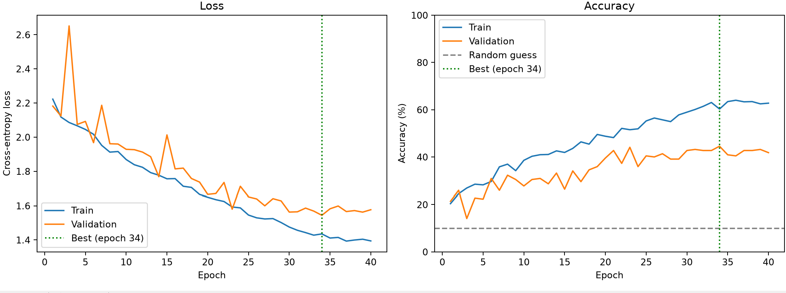
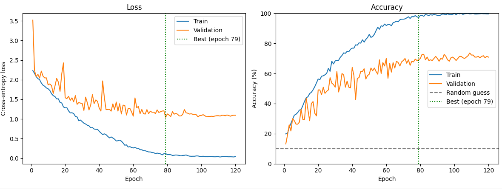

[['Beagle', 100], ['Boxer', 100], ['Bulldog', 100], ['Dachshund', 96], ['German_Shepherd', 96], ['Golden_Retriever', 91], ['Labrador_Retriever', 95], ['Poodle', 100], ['Rottweiler', 89], ['Yorkshire_Terrier', 100]]

DOG BREED CLASSIFIER
====================

[ ] 1. Explore dataset
[ ] 2. Validate dataset
[ ] 3. Visualise images
[ ] 4. Analyse image dimensions
[ ] 5. Identify potential data problems
[ ] 6. Create train/validation/test split
[ ] 7. Build image preprocessing pipeline
[ ] 8. Build Dataset/DataLoader
[ ] 9. Build basic CNN
[ ] 10. Train baseline model
[ ] 11. Plot training/validation loss
[ ] 12. Evaluate test set
[ ] 13. Create confusion matrix
[ ] 14. Investigate incorrect predictions
[ ] 15. Improve model
[ ] 16. Experiment with augmentation
[ ] 17. Experiment with architecture
[ ] 18. Test on external images
[ ] 19. Save trained model
[ ] 20. Build simple application

Val accuracy roughly equal 20% but decreasing each epoch:

One problem - model does well with training data but as training accuracy goes to 100%, validation accuracy decreases.
this is because the model is memorizing the images and not learning them.

Potential causes - all parameters on final layer of network

each feature looks at small area of pixels, meaning model might be able to see a section of eye for example, but not big enough to distinguish a head or ear

only 150 images per dog and when dog breed look as similar as they do this can cause issues

FIXES:

augments the input images - by changing the images each epoch the model is seeing the exact same pixels, making it harder for it to purely memorise every single training image

global average pool instead of one bit flattening layer - instead of flattening huge map, average all 64 channels and use nn.linear to convert to 10 values. This removes most of the models ability to memorize and will generalise the features findings more.

add more conv->pool blocks, each block expands the models range of view, allowing it to distinguish between bigger features in the image

 Experiment   │ Best val acc │ Epoch of best val loss │ Train/val gap │   Notes   │
├────────────────┼──────────────┼────────────────────────┼───────────────┼───────────┤
│ Baseline       │ 21.8%        │ 3                      │ huge          │ memorises │
├────────────────┼──────────────┼────────────────────────┼───────────────┼───────────┤
│ + augmentation │ 24.1         │ 13                     │ small(10)     │ learns    │
├────────────────┼──────────────┼────────────────────────┼───────────────┼───────────┤
│ + GAP + deeper │ 36.8%        │ 39                     │ small(5)      │

What changed in the code

- DogCNN now has 4 conv→ReLU→pool blocks (conv3: 64→128, conv4: 128→256).
- Flatten → Linear(87,616 → 10) was replaced with AdaptiveAvgPool2d(1) → Flatten → Linear(256 → 10).
- NUM_EPOCHS went from 15 to 40, because a model that can't memorise learns more slowly.

Why max pooling? It keeps the strongest signal in each window. If a filter detects "eye," it doesn't matter which of the 4 pixels the eye fell on, so the network gets a little tolerance for small shifts. It also has zero parameters.

5. Shapes through your model

┌─────────────────────┬──────────────────────────┬──────────────────────┐
│        Layer        │ Output shape (C × H × W) │ Values in the output │
├─────────────────────┼──────────────────────────┼──────────────────────┤
│ input               │ 3 × 150 × 150            │ 67,500               │
├─────────────────────┼──────────────────────────┼──────────────────────┤
│ conv1 → relu → pool │ 32 × 75 × 75             │ 180,000              │
├─────────────────────┼──────────────────────────┼──────────────────────┤
│ conv2 → relu → pool │ 64 × 37 × 37             │ 87,616               │
├─────────────────────┼──────────────────────────┼──────────────────────┤
│ conv3 → relu → pool │ 128 × 18 × 18            │ 41,472               │
├─────────────────────┼──────────────────────────┼──────────────────────┤
│ conv4 → relu → pool │ 256 × 9 × 9              │ 20,736               │
├─────────────────────┼──────────────────────────┼──────────────────────┤
│ global_pool         │ 256 × 1 × 1              │ 256                  │
├─────────────────────┼──────────────────────────┼──────────────────────┤
│ flatten             │ 256                      │ 256                  │
├─────────────────────┼──────────────────────────┼──────────────────────┤
│ fc                  │ 10                       │ 10                   │

   -- model after image augmentation

┌──────────────────────┬──────────────────────────────┬──────────────────────────────────────────┐
│                      │ 2-block model + augmentation │ 4 blocks + global pooling + augmentation │
├──────────────────────┼──────────────────────────────┼──────────────────────────────────────────┤
│ Epochs               │ 15                           │ 40                                       │
├──────────────────────┼──────────────────────────────┼──────────────────────────────────────────┤
│ Train acc at end     │ 38.1%                        │ 38.6%                                    │
├──────────────────────┼──────────────────────────────┼──────────────────────────────────────────┤
│ Val acc at end       │ 21.4%                        │ 33.6%                                    │
├──────────────────────┼──────────────────────────────┼──────────────────────────────────────────┤
│ Best val acc         │ 24.1%                        │ 36.8% (epoch 39)                         │
├──────────────────────┼──────────────────────────────┼──────────────────────────────────────────┤
│ Lowest val loss      │ 2.186                        │ 1.889 (epoch 36)                         │
├──────────────────────┼──────────────────────────────┼──────────────────────────────────────────┤
│ Train/val gap at end │ ~17 pts                      │ ~5 pts                                   │
└──────────────────────┴──────────────────────────────┴──────────────────────────────────────────┘

now adding on batchnorm:

Part 1: How batch normalisation works

The problem it solves

Your step 1 run showed it: epochs 1–2 sat at a loss of 2.303 (pure guessing), and validation loss didn't clearly drop until about epoch 15.

The cause is how the size of values changes as they pass through layers. Each conv multiplies its input by weights and adds the results. Depending on those random starting weights, a layer's outputs can come out much bigger, much smaller, or shifted off-centre compared with its inputs. With 4 layers stacked, those effects multiply:
- Values drift too far negative: ReLU (max(0, x)) turns most of them to 0. Those neurons output nothing and pass back no gradient, so they barely learn.
- Values get too large or too small: gradients become too big or too small, and training creeps or bounces around.
- The target keeps moving: every time conv1's weights update, the range of values conv2 receives changes, so conv2 is always adjusting to a new input. This is sometimes called "internal covariate shift." Researchers still debate how much it matters, but the practical benefit of BatchNorm is well established.

BatchNorm fixes this by rescaling each channel's values to a standard range after every conv, so the next layer always gets well-behaved input.

big problems in this one^^  - validation performance was very jumpy, despite training performance steadily increasing.

one possible cause is the fact that the learning rate is fixed at 0.01 meaning that even though the model may be approaching in the right direction in the final bit of training, one big change can set it off track. so we can vary this learning rate and reduce it gradually to stop this error.

Another way to improve it is to save the best model each time, as in this case the best model occured at epoch 31/40 so taking epoch 40's version as the final product will be leaving out a better option.

here is the result

it worked better and managed to achieved a loss of 1.481 at epoch 38/40 whilst maintaining a smooth descent and the model that was saved was epoch 38 not 40 as my changes hoped.

now changing the normalisation at the start so each channel (R,G,B) has mean 0 and standard deviation 1, shouldnt have a huge effect because batch normalisation layer achieves this after first block but is good practice

 loss 1.435 and 50.9% accuracy

now adding dropout to force features in training to search for stronger more meaningful relationship, also increasing epoch count as this may mean the model requires longer to learn.

dropout resulted in slightly worse best loss despite having 60 epochs rather than 40, so Ive chosen to try to crop all the images before training as the dataset comes with predetermined bounding boxes. this will mean all new images passed into the model will have to be cropped too but I think that will be achieveable with an object detection model

 good results from this achieved loss of 1.302 with best accuracy 55.5%

next steps:

1. Stronger augmentation (best value for the time). Your current set is mild: ±12px shifts, flips, ±20% brightness. With a 20-point gap, it's worth more:
- Scale jitter: crop a random 60–100% of the image and resize back to 150. This is RandomResizedCrop, the single most effective augmentation for this kind of task, and it also teaches the model that dogs come at different sizes, partly making up for the size clue that cropping removed.
- Small rotations (±15°).
- Mild colour jitter on saturation and contrast (leave hue alone, since coat colour matters).

Same epoch time, and it targets the gap directly.

2. Label smoothing: a one-line change. nn.CrossEntropyLoss(label_smoothing=0.1) asks the model to aim for 90% confidence rather than 100%. With genuinely confusable pairs like Beagle and Basset, demanding total confidence pushes the model to latch onto unreliable details. It usually gives a small, cheap gain on fine-grained problems.

3. Weight decay: switch Adam to AdamW(..., weight_decay=1e-4). Another small, cheap regulariser.

 resulted in much worse results.

now adding residual blocks

Part 1: why residual blocks

Stacking more conv layers should let the model see bigger, more complex features, but past a certain depth plain stacked convs get harder to train - each layer's gradient has to pass back through every layer before it, and it can shrink to nothing by the time it reaches the early layers.

A residual block adds the block's input back onto its output (out = conv_path(x) + x) instead of only passing it through the convs. This gives two things:
- the block only has to learn what to *change* about its input, rather than reconstruct the whole thing from scratch
- gradients get a direct path backwards through the "+", skipping the convs entirely, so early layers keep getting a useful signal even in a deeper network

Swapped the 4 plain conv->relu->pool blocks for 4 residual blocks (32->32, 32->64, 64->128, 128->256), using stride-2 convs to downsample instead of separate pool layers. Also bumped epochs 60 -> 120 since the model now has a lot more capacity to make use of.

Results (best model picked by val loss, as before):

┌───────────────────────┬───────────────────────┬────────────────────────┐
│                        │ dropout + crop (60ep) │ residual blocks (120ep)│
├────────────────────────┼───────────────────────┼────────────────────────┤
│ Best val acc           │ 55.5%                 │ 74.1% (epoch 109)      │
├────────────────────────┼───────────────────────┼────────────────────────┤
│ Lowest val loss        │ 1.302                 │ 1.116 (epoch 76)       │
├────────────────────────┼───────────────────────┼────────────────────────┤
│ Val acc at best-loss ep│ -                     │ 67.3%                  │
├────────────────────────┼───────────────────────┼────────────────────────┤
│ Train acc at end       │ -                     │ 99.7%                  │
├────────────────────────┼───────────────────────┼────────────────────────┤
│ Val acc at end         │ -                     │ 72.7%                  │
└────────────────────────┴───────────────────────┴────────────────────────┘

big jump in best val acc (55.5% -> 74.1%), so the extra depth/capacity from the residual connections is clearly helping the model find better features.

but the overfitting problem is back in a big way: train acc hits 100% by around epoch 99 while val loss stopped improving after epoch 76 (and drifts slightly upward after that). Val accuracy stays noisy and roughly flat (67-74%) for the whole second half of training even as train accuracy keeps climbing to 100%, so most of those last ~45 epochs are the model memorising the training set rather than learning anything new. Train/val gap at the end is ~27 points, similar in shape to the very first "huge gap" baseline problem, just at a much higher val accuracy this time.

Results:

Epoch 1/120  lr 0.001000  train loss 2.254 acc 16.5%  |  val loss 2.223 acc 14.5%  (15s)  *
Epoch 2/120  lr 0.001000  train loss 2.118 acc 21.2%  |  val loss 2.318 acc 15.0%  (19s)
Epoch 3/120  lr 0.000999  train loss 2.055 acc 25.8%  |  val loss 2.095 acc 23.6%  (18s)  *
Epoch 4/120  lr 0.000998  train loss 2.010 acc 25.9%  |  val loss 2.040 acc 27.7%  (15s)  *
Epoch 5/120  lr 0.000997  train loss 1.931 acc 30.0%  |  val loss 2.099 acc 20.9%  (15s)
Epoch 6/120  lr 0.000996  train loss 1.907 acc 32.0%  |  val loss 2.189 acc 26.4%  (15s)
Epoch 7/120  lr 0.000994  train loss 1.850 acc 33.5%  |  val loss 1.823 acc 35.9%  (15s)  *
Epoch 8/120  lr 0.000992  train loss 1.768 acc 36.4%  |  val loss 1.961 acc 31.4%  (15s)
Epoch 9/120  lr 0.000989  train loss 1.715 acc 38.5%  |  val loss 2.483 acc 27.7%  (15s)
Epoch 10/120  lr 0.000986  train loss 1.642 acc 41.6%  |  val loss 2.038 acc 35.9%  (16s)
Epoch 11/120  lr 0.000983  train loss 1.605 acc 43.3%  |  val loss 1.815 acc 33.6%  (15s)  *
Epoch 12/120  lr 0.000979  train loss 1.551 acc 44.8%  |  val loss 2.048 acc 29.1%  (15s)
Epoch 13/120  lr 0.000976  train loss 1.472 acc 48.0%  |  val loss 2.737 acc 26.4%  (16s)
Epoch 14/120  lr 0.000971  train loss 1.451 acc 50.1%  |  val loss 1.740 acc 37.3%  (17s)  *
Epoch 15/120  lr 0.000967  train loss 1.425 acc 50.2%  |  val loss 1.697 acc 40.9%  (17s)  *
Epoch 16/120  lr 0.000962  train loss 1.330 acc 51.3%  |  val loss 1.901 acc 39.1%  (17s)
Epoch 17/120  lr 0.000957  train loss 1.278 acc 55.6%  |  val loss 1.694 acc 39.5%  (17s)  *
Epoch 18/120  lr 0.000951  train loss 1.279 acc 55.2%  |  val loss 1.614 acc 48.2%  (18s)  *
Epoch 19/120  lr 0.000946  train loss 1.232 acc 58.5%  |  val loss 1.613 acc 45.9%  (17s)  *
Epoch 20/120  lr 0.000939  train loss 1.220 acc 56.3%  |  val loss 1.777 acc 41.8%  (17s)
Epoch 21/120  lr 0.000933  train loss 1.195 acc 57.1%  |  val loss 1.595 acc 41.8%  (19s)  *
Epoch 22/120  lr 0.000926  train loss 1.144 acc 60.4%  |  val loss 1.726 acc 45.9%  (22s)
Epoch 23/120  lr 0.000919  train loss 1.080 acc 63.2%  |  val loss 1.490 acc 49.5%  (20s)  *
Epoch 24/120  lr 0.000912  train loss 1.063 acc 61.3%  |  val loss 1.406 acc 52.3%  (19s)  *
Epoch 25/120  lr 0.000905  train loss 1.004 acc 64.8%  |  val loss 1.875 acc 42.3%  (19s)
Epoch 26/120  lr 0.000897  train loss 1.003 acc 63.0%  |  val loss 1.490 acc 54.5%  (19s)
Epoch 27/120  lr 0.000889  train loss 0.934 acc 66.5%  |  val loss 1.923 acc 41.4%  (18s)
Epoch 28/120  lr 0.000880  train loss 0.944 acc 67.6%  |  val loss 1.388 acc 51.8%  (18s)  *
Epoch 29/120  lr 0.000872  train loss 0.920 acc 69.3%  |  val loss 1.879 acc 43.2%  (18s)
Epoch 30/120  lr 0.000863  train loss 0.850 acc 69.1%  |  val loss 1.782 acc 50.5%  (18s)
Epoch 31/120  lr 0.000854  train loss 0.868 acc 68.8%  |  val loss 1.327 acc 53.6%  (18s)  *
Epoch 32/120  lr 0.000844  train loss 0.785 acc 74.7%  |  val loss 1.911 acc 49.1%  (17s)
Epoch 33/120  lr 0.000835  train loss 0.797 acc 71.0%  |  val loss 1.365 acc 55.9%  (16s)
Epoch 34/120  lr 0.000825  train loss 0.787 acc 72.3%  |  val loss 1.626 acc 51.4%  (18s)
Epoch 35/120  lr 0.000815  train loss 0.663 acc 77.4%  |  val loss 1.604 acc 45.5%  (17s)
Epoch 36/120  lr 0.000804  train loss 0.675 acc 77.0%  |  val loss 1.616 acc 51.8%  (15s)
Epoch 37/120  lr 0.000794  train loss 0.640 acc 77.0%  |  val loss 1.697 acc 50.0%  (16s)
Epoch 38/120  lr 0.000783  train loss 0.605 acc 78.5%  |  val loss 1.493 acc 53.6%  (16s)
Epoch 39/120  lr 0.000772  train loss 0.559 acc 81.4%  |  val loss 1.727 acc 54.5%  (15s)
Epoch 40/120  lr 0.000761  train loss 0.574 acc 80.4%  |  val loss 1.500 acc 58.6%  (16s)
Epoch 41/120  lr 0.000750  train loss 0.556 acc 81.5%  |  val loss 1.279 acc 58.6%  (16s)  *
Epoch 42/120  lr 0.000739  train loss 0.527 acc 81.9%  |  val loss 1.425 acc 55.9%  (16s)
Epoch 43/120  lr 0.000727  train loss 0.508 acc 83.0%  |  val loss 1.475 acc 53.6%  (16s)
Epoch 44/120  lr 0.000715  train loss 0.473 acc 84.7%  |  val loss 1.646 acc 53.2%  (16s)
Epoch 45/120  lr 0.000703  train loss 0.469 acc 84.9%  |  val loss 1.463 acc 55.9%  (17s)
Epoch 46/120  lr 0.000691  train loss 0.396 acc 87.9%  |  val loss 1.438 acc 60.0%  (18s)
Epoch 47/120  lr 0.000679  train loss 0.400 acc 86.5%  |  val loss 1.217 acc 65.0%  (16s)  *
Epoch 48/120  lr 0.000667  train loss 0.409 acc 87.0%  |  val loss 1.552 acc 58.2%  (16s)
Epoch 49/120  lr 0.000655  train loss 0.386 acc 88.0%  |  val loss 1.273 acc 61.4%  (16s)
Epoch 50/120  lr 0.000642  train loss 0.356 acc 88.7%  |  val loss 1.243 acc 64.5%  (16s)
Epoch 51/120  lr 0.000629  train loss 0.311 acc 90.8%  |  val loss 1.346 acc 62.7%  (16s)
Epoch 52/120  lr 0.000617  train loss 0.282 acc 92.2%  |  val loss 1.353 acc 61.4%  (16s)
Epoch 53/120  lr 0.000604  train loss 0.298 acc 91.4%  |  val loss 1.407 acc 61.8%  (16s)
Epoch 54/120  lr 0.000591  train loss 0.274 acc 91.7%  |  val loss 1.522 acc 61.4%  (17s)
Epoch 55/120  lr 0.000578  train loss 0.262 acc 91.9%  |  val loss 1.306 acc 63.2%  (16s)
Epoch 56/120  lr 0.000565  train loss 0.256 acc 92.4%  |  val loss 1.497 acc 61.8%  (16s)
Epoch 57/120  lr 0.000552  train loss 0.263 acc 91.6%  |  val loss 1.642 acc 58.2%  (16s)
Epoch 58/120  lr 0.000539  train loss 0.252 acc 92.6%  |  val loss 1.375 acc 58.6%  (16s)
Epoch 59/120  lr 0.000526  train loss 0.198 acc 94.3%  |  val loss 1.275 acc 65.0%  (16s)
Epoch 60/120  lr 0.000513  train loss 0.189 acc 94.8%  |  val loss 1.321 acc 64.5%  (16s)
Epoch 61/120  lr 0.000500  train loss 0.173 acc 95.6%  |  val loss 1.556 acc 56.8%  (16s)
Epoch 62/120  lr 0.000487  train loss 0.159 acc 96.5%  |  val loss 1.295 acc 67.7%  (16s)
Epoch 63/120  lr 0.000474  train loss 0.162 acc 96.4%  |  val loss 1.327 acc 63.2%  (16s)
Epoch 64/120  lr 0.000461  train loss 0.132 acc 97.5%  |  val loss 1.263 acc 65.0%  (16s)
Epoch 65/120  lr 0.000448  train loss 0.123 acc 97.6%  |  val loss 1.324 acc 60.5%  (16s)
Epoch 66/120  lr 0.000435  train loss 0.123 acc 97.0%  |  val loss 1.268 acc 67.7%  (16s)
Epoch 67/120  lr 0.000422  train loss 0.132 acc 97.2%  |  val loss 1.355 acc 65.5%  (16s)
Epoch 68/120  lr 0.000409  train loss 0.117 acc 97.1%  |  val loss 1.224 acc 69.1%  (16s)
Epoch 69/120  lr 0.000396  train loss 0.111 acc 98.1%  |  val loss 1.438 acc 63.6%  (16s)
Epoch 70/120  lr 0.000383  train loss 0.082 acc 99.0%  |  val loss 1.285 acc 65.0%  (16s)
Epoch 71/120  lr 0.000371  train loss 0.083 acc 98.4%  |  val loss 1.396 acc 64.1%  (16s)
Epoch 72/120  lr 0.000358  train loss 0.090 acc 97.9%  |  val loss 1.186 acc 68.6%  (16s)  *
Epoch 73/120  lr 0.000345  train loss 0.084 acc 97.9%  |  val loss 1.233 acc 70.0%  (16s)
Epoch 74/120  lr 0.000333  train loss 0.074 acc 99.0%  |  val loss 1.160 acc 69.1%  (16s)  *
Epoch 75/120  lr 0.000321  train loss 0.064 acc 99.4%  |  val loss 1.235 acc 65.0%  (16s)
Epoch 76/120  lr 0.000309  train loss 0.056 acc 99.2%  |  val loss 1.116 acc 67.3%  (17s)  *
Epoch 77/120  lr 0.000297  train loss 0.047 acc 99.6%  |  val loss 1.176 acc 66.4%  (16s)
Epoch 78/120  lr 0.000285  train loss 0.047 acc 99.5%  |  val loss 1.250 acc 67.7%  (16s)
Epoch 79/120  lr 0.000273  train loss 0.052 acc 99.4%  |  val loss 1.354 acc 64.1%  (16s)
Epoch 80/120  lr 0.000261  train loss 0.050 acc 99.5%  |  val loss 1.206 acc 68.2%  (17s)
Epoch 81/120  lr 0.000250  train loss 0.042 acc 99.4%  |  val loss 1.190 acc 67.7%  (16s)
Epoch 82/120  lr 0.000239  train loss 0.048 acc 99.4%  |  val loss 1.171 acc 70.9%  (16s)
Epoch 83/120  lr 0.000228  train loss 0.044 acc 99.4%  |  val loss 1.356 acc 64.5%  (20s)
Epoch 84/120  lr 0.000217  train loss 0.050 acc 99.0%  |  val loss 1.147 acc 69.1%  (17s)
Epoch 85/120  lr 0.000206  train loss 0.043 acc 99.2%  |  val loss 1.237 acc 66.8%  (16s)
Epoch 86/120  lr 0.000196  train loss 0.041 acc 99.6%  |  val loss 1.161 acc 69.1%  (17s)
Epoch 87/120  lr 0.000185  train loss 0.031 acc 99.9%  |  val loss 1.220 acc 70.0%  (17s)
Epoch 88/120  lr 0.000175  train loss 0.044 acc 99.5%  |  val loss 1.197 acc 69.5%  (17s)
Epoch 89/120  lr 0.000165  train loss 0.036 acc 99.4%  |  val loss 1.192 acc 68.6%  (17s)
Epoch 90/120  lr 0.000156  train loss 0.032 acc 99.8%  |  val loss 1.152 acc 70.5%  (16s)
Epoch 91/120  lr 0.000146  train loss 0.034 acc 99.8%  |  val loss 1.197 acc 69.1%  (16s)
Epoch 92/120  lr 0.000137  train loss 0.028 acc 99.7%  |  val loss 1.166 acc 68.6%  (16s)
Epoch 93/120  lr 0.000128  train loss 0.028 acc 99.6%  |  val loss 1.178 acc 69.1%  (16s)
Epoch 94/120  lr 0.000120  train loss 0.029 acc 99.9%  |  val loss 1.148 acc 69.5%  (16s)
Epoch 95/120  lr 0.000111  train loss 0.032 acc 99.6%  |  val loss 1.168 acc 70.9%  (16s)
Epoch 96/120  lr 0.000103  train loss 0.028 acc 99.7%  |  val loss 1.195 acc 70.5%  (16s)
Epoch 97/120  lr 0.000095  train loss 0.028 acc 99.6%  |  val loss 1.157 acc 69.5%  (18s)
Epoch 98/120  lr 0.000088  train loss 0.024 acc 99.8%  |  val loss 1.199 acc 70.5%  (16s)
Epoch 99/120  lr 0.000081  train loss 0.021 acc 100.0%  |  val loss 1.181 acc 70.9%  (16s)
Epoch 100/120  lr 0.000074  train loss 0.021 acc 99.9%  |  val loss 1.199 acc 70.0%  (16s)
Epoch 101/120  lr 0.000067  train loss 0.023 acc 99.8%  |  val loss 1.171 acc 70.0%  (17s)
Epoch 102/120  lr 0.000061  train loss 0.024 acc 99.8%  |  val loss 1.167 acc 71.4%  (17s)
Epoch 103/120  lr 0.000054  train loss 0.024 acc 99.9%  |  val loss 1.175 acc 71.8%  (16s)
Epoch 104/120  lr 0.000049  train loss 0.026 acc 99.7%  |  val loss 1.183 acc 70.0%  (16s)
Epoch 105/120  lr 0.000043  train loss 0.027 acc 99.6%  |  val loss 1.196 acc 72.3%  (17s)
Epoch 106/120  lr 0.000038  train loss 0.020 acc 100.0%  |  val loss 1.165 acc 71.8%  (19s)
Epoch 107/120  lr 0.000033  train loss 0.022 acc 99.8%  |  val loss 1.181 acc 72.3%  (17s)
Epoch 108/120  lr 0.000029  train loss 0.024 acc 99.9%  |  val loss 1.188 acc 71.4%  (18s)
Epoch 109/120  lr 0.000024  train loss 0.020 acc 99.9%  |  val loss 1.169 acc 74.1%  (17s)
Epoch 110/120  lr 0.000021  train loss 0.021 acc 99.9%  |  val loss 1.172 acc 71.4%  (18s)
Epoch 111/120  lr 0.000017  train loss 0.020 acc 99.9%  |  val loss 1.169 acc 72.3%  (23s)
Epoch 112/120  lr 0.000014  train loss 0.024 acc 99.7%  |  val loss 1.193 acc 70.5%  (18s)
Epoch 113/120  lr 0.000011  train loss 0.020 acc 99.8%  |  val loss 1.168 acc 71.8%  (18s)
Epoch 114/120  lr 0.000008  train loss 0.023 acc 99.9%  |  val loss 1.160 acc 73.6%  (17s)
Epoch 115/120  lr 0.000006  train loss 0.023 acc 99.9%  |  val loss 1.173 acc 70.0%  (17s)
Epoch 116/120  lr 0.000004  train loss 0.021 acc 100.0%  |  val loss 1.186 acc 72.3%  (16s)
Epoch 117/120  lr 0.000003  train loss 0.025 acc 99.9%  |  val loss 1.166 acc 70.9%  (16s)
Epoch 118/120  lr 0.000002  train loss 0.020 acc 100.0%  |  val loss 1.170 acc 72.3%  (17s)
Epoch 119/120  lr 0.000001  train loss 0.019 acc 99.8%  |  val loss 1.167 acc 70.9%  (18s)
Epoch 120/120  lr 0.000000  train loss 0.024 acc 99.7%  |  val loss 1.175 acc 72.7%  (17s)
Loaded best model from epoch 76 (val loss 1.116)

Next step was to add stronger augmentation to try to close the gap between the training loss and the validation loss and reduce overfittting. After adding random rotations, saturations, contrast, and brightness the results were not as hoped. Although the training loss was increased as expected the validation loss was also and the gap was even bigger (roughly 45% at the end).

Epoch 1/120  lr 0.001000  train loss 2.259 acc 15.6%  |  val loss 2.280 acc 20.5%  (3s)  *
Epoch 2/120  lr 0.001000  train loss 2.122 acc 20.8%  |  val loss 2.123 acc 20.9%  (3s)  *
Epoch 3/120  lr 0.000999  train loss 2.069 acc 24.0%  |  val loss 2.133 acc 22.3%  (3s)
Epoch 4/120  lr 0.000998  train loss 2.016 acc 27.2%  |  val loss 2.071 acc 25.9%  (3s)  *
Epoch 5/120  lr 0.000997  train loss 1.965 acc 29.7%  |  val loss 2.131 acc 26.8%  (3s)
Epoch 6/120  lr 0.000996  train loss 1.941 acc 29.2%  |  val loss 2.245 acc 23.6%  (3s)
Epoch 7/120  lr 0.000994  train loss 1.875 acc 31.0%  |  val loss 2.265 acc 25.0%  (3s)
Epoch 8/120  lr 0.000992  train loss 1.858 acc 35.6%  |  val loss 2.266 acc 25.5%  (3s)
Epoch 9/120  lr 0.000989  train loss 1.845 acc 31.5%  |  val loss 1.873 acc 32.3%  (3s)  *
Epoch 10/120  lr 0.000986  train loss 1.817 acc 34.5%  |  val loss 2.180 acc 23.6%  (3s)
Epoch 11/120  lr 0.000983  train loss 1.769 acc 37.8%  |  val loss 1.916 acc 29.5%  (3s)
Epoch 12/120  lr 0.000979  train loss 1.748 acc 37.0%  |  val loss 1.879 acc 27.7%  (3s)
Epoch 13/120  lr 0.000976  train loss 1.711 acc 38.6%  |  val loss 1.874 acc 32.7%  (3s)
Epoch 14/120  lr 0.000971  train loss 1.648 acc 41.4%  |  val loss 1.989 acc 27.3%  (3s)
Epoch 15/120  lr 0.000967  train loss 1.657 acc 39.0%  |  val loss 1.909 acc 30.9%  (3s)
Epoch 16/120  lr 0.000962  train loss 1.596 acc 42.4%  |  val loss 1.827 acc 34.5%  (3s)  *
Epoch 17/120  lr 0.000957  train loss 1.573 acc 43.9%  |  val loss 1.805 acc 31.8%  (3s)  *
Epoch 18/120  lr 0.000951  train loss 1.504 acc 44.5%  |  val loss 1.868 acc 33.2%  (3s)
Epoch 19/120  lr 0.000946  train loss 1.511 acc 46.3%  |  val loss 1.796 acc 32.7%  (3s)  *
Epoch 20/120  lr 0.000939  train loss 1.472 acc 48.1%  |  val loss 1.890 acc 39.5%  (3s)
Epoch 21/120  lr 0.000933  train loss 1.420 acc 49.1%  |  val loss 1.796 acc 35.5%  (3s)
Epoch 22/120  lr 0.000926  train loss 1.378 acc 52.5%  |  val loss 1.562 acc 41.4%  (3s)  *
Epoch 23/120  lr 0.000919  train loss 1.333 acc 51.9%  |  val loss 1.673 acc 42.3%  (3s)
Epoch 24/120  lr 0.000912  train loss 1.298 acc 54.6%  |  val loss 1.765 acc 36.4%  (3s)
Epoch 25/120  lr 0.000905  train loss 1.283 acc 54.3%  |  val loss 1.690 acc 45.9%  (3s)
Epoch 26/120  lr 0.000897  train loss 1.263 acc 56.2%  |  val loss 1.971 acc 37.3%  (3s)
Epoch 27/120  lr 0.000889  train loss 1.207 acc 57.3%  |  val loss 2.334 acc 26.8%  (3s)
Epoch 28/120  lr 0.000880  train loss 1.179 acc 57.2%  |  val loss 1.708 acc 37.3%  (3s)
Epoch 29/120  lr 0.000872  train loss 1.142 acc 59.4%  |  val loss 1.689 acc 40.0%  (3s)
Epoch 30/120  lr 0.000863  train loss 1.109 acc 62.5%  |  val loss 1.692 acc 40.5%  (3s)
Epoch 31/120  lr 0.000854  train loss 1.123 acc 61.0%  |  val loss 1.747 acc 44.5%  (3s)
Epoch 32/120  lr 0.000844  train loss 1.065 acc 63.5%  |  val loss 1.812 acc 40.9%  (3s)
Epoch 33/120  lr 0.000835  train loss 1.047 acc 64.2%  |  val loss 2.083 acc 38.6%  (3s)
Epoch 34/120  lr 0.000825  train loss 1.004 acc 65.4%  |  val loss 1.538 acc 44.5%  (3s)  *
Epoch 35/120  lr 0.000815  train loss 0.938 acc 67.3%  |  val loss 1.695 acc 40.9%  (3s)
Epoch 36/120  lr 0.000804  train loss 0.955 acc 66.0%  |  val loss 1.292 acc 55.5%  (3s)  *
Epoch 37/120  lr 0.000794  train loss 0.893 acc 70.2%  |  val loss 1.682 acc 48.2%  (3s)
Epoch 38/120  lr 0.000783  train loss 0.877 acc 68.5%  |  val loss 1.450 acc 49.1%  (3s)
Epoch 39/120  lr 0.000772  train loss 0.869 acc 69.0%  |  val loss 1.641 acc 44.5%  (3s)
Epoch 40/120  lr 0.000761  train loss 0.797 acc 73.1%  |  val loss 1.527 acc 49.1%  (3s)
Epoch 41/120  lr 0.000750  train loss 0.812 acc 72.8%  |  val loss 1.505 acc 51.4%  (3s)
Epoch 42/120  lr 0.000739  train loss 0.746 acc 73.7%  |  val loss 1.786 acc 43.2%  (3s)
Epoch 43/120  lr 0.000727  train loss 0.744 acc 75.0%  |  val loss 1.986 acc 37.3%  (3s)
Epoch 44/120  lr 0.000715  train loss 0.701 acc 76.1%  |  val loss 1.553 acc 49.1%  (3s)
Epoch 45/120  lr 0.000703  train loss 0.713 acc 74.9%  |  val loss 1.810 acc 46.4%  (3s)
Epoch 46/120  lr 0.000691  train loss 0.671 acc 75.7%  |  val loss 1.543 acc 49.1%  (3s)
Epoch 47/120  lr 0.000679  train loss 0.622 acc 79.1%  |  val loss 1.524 acc 49.5%  (3s)
Epoch 48/120  lr 0.000667  train loss 0.623 acc 79.9%  |  val loss 1.695 acc 47.7%  (3s)
Epoch 49/120  lr 0.000655  train loss 0.637 acc 78.5%  |  val loss 1.768 acc 47.7%  (3s)
Epoch 50/120  lr 0.000642  train loss 0.557 acc 81.7%  |  val loss 1.848 acc 44.5%  (3s)
Epoch 51/120  lr 0.000629  train loss 0.520 acc 83.4%  |  val loss 1.855 acc 45.9%  (3s)
Epoch 52/120  lr 0.000617  train loss 0.536 acc 83.4%  |  val loss 1.472 acc 52.7%  (3s)
Epoch 53/120  lr 0.000604  train loss 0.474 acc 84.9%  |  val loss 1.792 acc 46.8%  (3s)
Epoch 54/120  lr 0.000591  train loss 0.499 acc 84.5%  |  val loss 1.405 acc 58.6%  (3s)
Epoch 55/120  lr 0.000578  train loss 0.458 acc 84.0%  |  val loss 1.949 acc 44.5%  (3s)
Epoch 56/120  lr 0.000565  train loss 0.427 acc 86.4%  |  val loss 1.807 acc 45.9%  (3s)
Epoch 57/120  lr 0.000552  train loss 0.409 acc 87.0%  |  val loss 1.761 acc 47.7%  (3s)
Epoch 58/120  lr 0.000539  train loss 0.399 acc 86.9%  |  val loss 1.679 acc 50.9%  (3s)
Epoch 59/120  lr 0.000526  train loss 0.370 acc 88.3%  |  val loss 1.829 acc 49.1%  (3s)
Epoch 60/120  lr 0.000513  train loss 0.367 acc 88.4%  |  val loss 1.519 acc 57.3%  (3s)
Epoch 61/120  lr 0.000500  train loss 0.351 acc 89.2%  |  val loss 1.448 acc 58.6%  (3s)
Epoch 62/120  lr 0.000487  train loss 0.335 acc 89.6%  |  val loss 1.368 acc 57.7%  (3s)
Epoch 63/120  lr 0.000474  train loss 0.306 acc 92.1%  |  val loss 1.585 acc 55.5%  (3s)
Epoch 64/120  lr 0.000461  train loss 0.304 acc 90.2%  |  val loss 1.633 acc 52.7%  (3s)
Epoch 65/120  lr 0.000448  train loss 0.252 acc 93.0%  |  val loss 1.843 acc 49.5%  (3s)
Epoch 66/120  lr 0.000435  train loss 0.249 acc 93.6%  |  val loss 1.660 acc 53.6%  (3s)
Epoch 67/120  lr 0.000422  train loss 0.275 acc 91.9%  |  val loss 1.714 acc 50.0%  (3s)
Epoch 68/120  lr 0.000409  train loss 0.235 acc 93.1%  |  val loss 1.466 acc 56.8%  (3s)
Epoch 69/120  lr 0.000396  train loss 0.220 acc 94.2%  |  val loss 1.485 acc 54.5%  (3s)
Epoch 70/120  lr 0.000383  train loss 0.203 acc 94.9%  |  val loss 1.457 acc 57.3%  (3s)
Epoch 71/120  lr 0.000371  train loss 0.210 acc 94.3%  |  val loss 1.816 acc 50.9%  (3s)
Epoch 72/120  lr 0.000358  train loss 0.193 acc 94.7%  |  val loss 1.742 acc 54.1%  (3s)
Epoch 73/120  lr 0.000345  train loss 0.156 acc 97.1%  |  val loss 1.929 acc 44.5%  (3s)
Epoch 74/120  lr 0.000333  train loss 0.155 acc 96.8%  |  val loss 1.526 acc 57.7%  (3s)
Epoch 75/120  lr 0.000321  train loss 0.157 acc 96.4%  |  val loss 1.583 acc 52.3%  (3s)
Epoch 76/120  lr 0.000309  train loss 0.158 acc 96.5%  |  val loss 1.526 acc 56.4%  (3s)
Epoch 77/120  lr 0.000297  train loss 0.150 acc 96.6%  |  val loss 1.582 acc 59.5%  (3s)
Epoch 78/120  lr 0.000285  train loss 0.140 acc 97.1%  |  val loss 1.528 acc 59.1%  (3s)
Epoch 79/120  lr 0.000273  train loss 0.127 acc 97.6%  |  val loss 1.426 acc 58.6%  (3s)
Epoch 80/120  lr 0.000261  train loss 0.128 acc 97.0%  |  val loss 1.899 acc 45.0%  (3s)
Epoch 81/120  lr 0.000250  train loss 0.105 acc 98.5%  |  val loss 1.529 acc 59.5%  (3s)
Epoch 82/120  lr 0.000239  train loss 0.102 acc 98.1%  |  val loss 1.530 acc 57.7%  (3s)
Epoch 83/120  lr 0.000228  train loss 0.106 acc 97.6%  |  val loss 1.455 acc 59.5%  (3s)
Epoch 84/120  lr 0.000217  train loss 0.115 acc 97.9%  |  val loss 1.575 acc 55.9%  (3s)
Epoch 85/120  lr 0.000206  train loss 0.092 acc 98.1%  |  val loss 1.516 acc 58.6%  (3s)
Epoch 86/120  lr 0.000196  train loss 0.102 acc 98.4%  |  val loss 1.513 acc 60.0%  (3s)
Epoch 87/120  lr 0.000185  train loss 0.086 acc 98.7%  |  val loss 1.588 acc 57.3%  (3s)
Epoch 88/120  lr 0.000175  train loss 0.100 acc 97.8%  |  val loss 1.658 acc 58.2%  (3s)
Epoch 89/120  lr 0.000165  train loss 0.093 acc 98.4%  |  val loss 1.492 acc 60.9%  (3s)
Epoch 90/120  lr 0.000156  train loss 0.081 acc 98.7%  |  val loss 1.486 acc 60.0%  (3s)
Epoch 91/120  lr 0.000146  train loss 0.079 acc 99.0%  |  val loss 1.462 acc 58.6%  (3s)
Epoch 92/120  lr 0.000137  train loss 0.078 acc 98.9%  |  val loss 1.538 acc 60.0%  (3s)
Epoch 93/120  lr 0.000128  train loss 0.070 acc 99.1%  |  val loss 1.476 acc 60.5%  (3s)
Epoch 94/120  lr 0.000120  train loss 0.075 acc 98.8%  |  val loss 1.510 acc 58.2%  (3s)
Epoch 95/120  lr 0.000111  train loss 0.078 acc 98.2%  |  val loss 1.464 acc 58.6%  (3s)
Epoch 96/120  lr 0.000103  train loss 0.060 acc 99.6%  |  val loss 1.487 acc 57.7%  (3s)
Epoch 97/120  lr 0.000095  train loss 0.071 acc 98.7%  |  val loss 1.483 acc 58.2%  (3s)
Epoch 98/120  lr 0.000088  train loss 0.068 acc 98.9%  |  val loss 1.523 acc 58.6%  (3s)
Epoch 99/120  lr 0.000081  train loss 0.070 acc 99.1%  |  val loss 1.487 acc 60.0%  (3s)
Epoch 100/120  lr 0.000074  train loss 0.055 acc 99.5%  |  val loss 1.538 acc 60.5%  (3s)
Epoch 101/120  lr 0.000067  train loss 0.059 acc 99.1%  |  val loss 1.461 acc 60.9%  (3s)
Epoch 102/120  lr 0.000061  train loss 0.065 acc 99.1%  |  val loss 1.517 acc 60.0%  (3s)
Epoch 103/120  lr 0.000054  train loss 0.056 acc 99.4%  |  val loss 1.559 acc 59.1%  (3s)
Epoch 104/120  lr 0.000049  train loss 0.069 acc 98.3%  |  val loss 1.575 acc 59.5%  (3s)
Epoch 105/120  lr 0.000043  train loss 0.056 acc 99.4%  |  val loss 1.521 acc 58.6%  (3s)
Epoch 106/120  lr 0.000038  train loss 0.052 acc 99.6%  |  val loss 1.493 acc 59.1%  (3s)
Epoch 107/120  lr 0.000033  train loss 0.056 acc 99.4%  |  val loss 1.464 acc 60.9%  (3s)
Epoch 108/120  lr 0.000029  train loss 0.055 acc 99.0%  |  val loss 1.492 acc 59.5%  (3s)
Epoch 109/120  lr 0.000024  train loss 0.056 acc 99.0%  |  val loss 1.489 acc 60.5%  (3s)
Epoch 110/120  lr 0.000021  train loss 0.058 acc 99.0%  |  val loss 1.462 acc 60.5%  (3s)
Epoch 111/120  lr 0.000017  train loss 0.050 acc 99.2%  |  val loss 1.484 acc 60.5%  (3s)
Epoch 112/120  lr 0.000014  train loss 0.054 acc 99.1%  |  val loss 1.497 acc 58.2%  (3s)
Epoch 113/120  lr 0.000011  train loss 0.046 acc 99.6%  |  val loss 1.499 acc 58.2%  (3s)
Epoch 114/120  lr 0.000008  train loss 0.046 acc 99.6%  |  val loss 1.527 acc 57.3%  (3s)
Epoch 115/120  lr 0.000006  train loss 0.049 acc 99.4%  |  val loss 1.476 acc 60.5%  (3s)
Epoch 116/120  lr 0.000004  train loss 0.052 acc 99.5%  |  val loss 1.508 acc 58.6%  (3s)
Epoch 117/120  lr 0.000003  train loss 0.048 acc 99.8%  |  val loss 1.476 acc 59.5%  (3s)
Epoch 118/120  lr 0.000002  train loss 0.048 acc 99.5%  |  val loss 1.475 acc 58.6%  (3s)
Epoch 119/120  lr 0.000001  train loss 0.050 acc 99.6%  |  val loss 1.510 acc 58.6%  (3s)
Epoch 120/120  lr 0.000000  train loss 0.055 acc 99.1%  |  val loss 1.487 acc 59.5%  (3s)
Loaded best model from epoch 36 (val loss 1.292)

Turns out after looking closer at some of the stronger augmentation functions that both the random resized cropping and random rotation were results in quite a serious loss of sharpness but after fixing those issues and just applying the random rotation with a slightly different mode (bicubic instead of linear) the model improved significantly:

Epoch 1/120  lr 0.001000  train loss 2.234 acc 19.9%  |  val loss 3.519 acc 13.2%  (3s)  *
Epoch 2/120  lr 0.001000  train loss 2.164 acc 20.3%  |  val loss 2.236 acc 19.1%  (3s)  *
Epoch 3/120  lr 0.000999  train loss 2.077 acc 24.1%  |  val loss 2.081 acc 25.9%  (3s)  *
Epoch 4/120  lr 0.000998  train loss 2.029 acc 26.9%  |  val loss 2.139 acc 21.8%  (3s)
Epoch 5/120  lr 0.000997  train loss 2.001 acc 29.6%  |  val loss 2.042 acc 30.0%  (3s)  *
Epoch 6/120  lr 0.000996  train loss 1.917 acc 32.3%  |  val loss 2.220 acc 28.6%  (3s)
Epoch 7/120  lr 0.000994  train loss 1.861 acc 33.0%  |  val loss 2.093 acc 26.4%  (3s)
Epoch 8/120  lr 0.000992  train loss 1.833 acc 34.1%  |  val loss 2.046 acc 26.4%  (3s)
Epoch 9/120  lr 0.000989  train loss 1.791 acc 35.7%  |  val loss 2.047 acc 27.7%  (3s)
Epoch 10/120  lr 0.000986  train loss 1.770 acc 36.0%  |  val loss 1.869 acc 36.4%  (3s)  *
Epoch 11/120  lr 0.000983  train loss 1.727 acc 38.7%  |  val loss 1.894 acc 29.5%  (3s)
Epoch 12/120  lr 0.000979  train loss 1.644 acc 41.5%  |  val loss 1.849 acc 29.5%  (3s)  *
Epoch 13/120  lr 0.000976  train loss 1.596 acc 43.9%  |  val loss 1.652 acc 43.6%  (3s)  *
Epoch 14/120  lr 0.000971  train loss 1.572 acc 44.6%  |  val loss 1.836 acc 35.9%  (3s)
Epoch 15/120  lr 0.000967  train loss 1.512 acc 46.7%  |  val loss 2.034 acc 28.6%  (3s)
Epoch 16/120  lr 0.000962  train loss 1.514 acc 47.5%  |  val loss 1.943 acc 40.0%  (3s)
Epoch 17/120  lr 0.000957  train loss 1.421 acc 49.1%  |  val loss 1.705 acc 41.4%  (3s)
Epoch 18/120  lr 0.000951  train loss 1.408 acc 51.2%  |  val loss 2.151 acc 33.6%  (3s)
Epoch 19/120  lr 0.000946  train loss 1.306 acc 53.7%  |  val loss 2.430 acc 31.8%  (3s)
Epoch 20/120  lr 0.000939  train loss 1.286 acc 56.4%  |  val loss 1.543 acc 49.1%  (3s)  *
Epoch 21/120  lr 0.000933  train loss 1.288 acc 55.9%  |  val loss 1.520 acc 49.1%  (3s)  *
Epoch 22/120  lr 0.000926  train loss 1.207 acc 58.2%  |  val loss 1.577 acc 45.9%  (3s)
Epoch 23/120  lr 0.000919  train loss 1.154 acc 58.5%  |  val loss 1.477 acc 50.9%  (3s)  *
Epoch 24/120  lr 0.000912  train loss 1.160 acc 59.1%  |  val loss 1.538 acc 46.8%  (3s)
Epoch 25/120  lr 0.000905  train loss 1.138 acc 60.1%  |  val loss 1.439 acc 48.2%  (3s)  *
Epoch 26/120  lr 0.000897  train loss 1.067 acc 63.4%  |  val loss 1.597 acc 49.1%  (3s)
Epoch 27/120  lr 0.000889  train loss 1.052 acc 61.4%  |  val loss 1.374 acc 57.3%  (3s)  *
Epoch 28/120  lr 0.000880  train loss 0.956 acc 68.2%  |  val loss 1.421 acc 53.6%  (3s)
Epoch 29/120  lr 0.000872  train loss 0.973 acc 66.4%  |  val loss 1.404 acc 52.7%  (3s)
Epoch 30/120  lr 0.000863  train loss 0.932 acc 68.4%  |  val loss 1.394 acc 50.9%  (3s)
Epoch 31/120  lr 0.000854  train loss 0.894 acc 68.8%  |  val loss 1.218 acc 61.4%  (3s)  *
Epoch 32/120  lr 0.000844  train loss 0.872 acc 68.8%  |  val loss 1.557 acc 47.7%  (3s)
Epoch 33/120  lr 0.000835  train loss 0.841 acc 70.8%  |  val loss 1.414 acc 52.3%  (3s)
Epoch 34/120  lr 0.000825  train loss 0.826 acc 72.0%  |  val loss 1.231 acc 60.0%  (3s)
Epoch 35/120  lr 0.000815  train loss 0.774 acc 73.7%  |  val loss 1.359 acc 59.1%  (3s)
Epoch 36/120  lr 0.000804  train loss 0.782 acc 73.4%  |  val loss 1.621 acc 50.9%  (3s)
Epoch 37/120  lr 0.000794  train loss 0.745 acc 74.8%  |  val loss 1.392 acc 55.0%  (3s)
Epoch 38/120  lr 0.000783  train loss 0.736 acc 74.5%  |  val loss 1.486 acc 50.9%  (3s)
Epoch 39/120  lr 0.000772  train loss 0.737 acc 76.1%  |  val loss 1.449 acc 50.5%  (3s)
Epoch 40/120  lr 0.000761  train loss 0.686 acc 76.9%  |  val loss 1.276 acc 64.1%  (3s)
Epoch 41/120  lr 0.000750  train loss 0.644 acc 76.9%  |  val loss 1.201 acc 58.6%  (3s)  *
Epoch 42/120  lr 0.000739  train loss 0.604 acc 79.0%  |  val loss 1.970 acc 42.7%  (3s)
Epoch 43/120  lr 0.000727  train loss 0.621 acc 78.9%  |  val loss 1.551 acc 56.8%  (3s)
Epoch 44/120  lr 0.000715  train loss 0.602 acc 80.4%  |  val loss 1.239 acc 57.3%  (3s)
Epoch 45/120  lr 0.000703  train loss 0.558 acc 80.2%  |  val loss 1.240 acc 61.4%  (3s)
Epoch 46/120  lr 0.000691  train loss 0.519 acc 82.4%  |  val loss 1.249 acc 61.4%  (3s)
Epoch 47/120  lr 0.000679  train loss 0.543 acc 80.9%  |  val loss 1.200 acc 63.2%  (3s)  *
Epoch 48/120  lr 0.000667  train loss 0.516 acc 82.7%  |  val loss 1.385 acc 56.4%  (3s)
Epoch 49/120  lr 0.000655  train loss 0.485 acc 83.9%  |  val loss 1.243 acc 58.6%  (3s)
Epoch 50/120  lr 0.000642  train loss 0.440 acc 86.0%  |  val loss 1.432 acc 59.5%  (3s)
Epoch 51/120  lr 0.000629  train loss 0.447 acc 84.0%  |  val loss 1.201 acc 63.6%  (3s)
Epoch 52/120  lr 0.000617  train loss 0.461 acc 84.6%  |  val loss 1.390 acc 61.8%  (3s)
Epoch 53/120  lr 0.000604  train loss 0.436 acc 86.1%  |  val loss 1.128 acc 63.6%  (3s)  *
Epoch 54/120  lr 0.000591  train loss 0.389 acc 88.5%  |  val loss 1.353 acc 61.4%  (3s)
Epoch 55/120  lr 0.000578  train loss 0.332 acc 90.8%  |  val loss 1.346 acc 59.5%  (3s)
Epoch 56/120  lr 0.000565  train loss 0.340 acc 89.4%  |  val loss 1.100 acc 69.1%  (3s)  *
Epoch 57/120  lr 0.000552  train loss 0.285 acc 91.7%  |  val loss 1.268 acc 60.0%  (3s)
Epoch 58/120  lr 0.000539  train loss 0.296 acc 91.3%  |  val loss 1.270 acc 67.3%  (3s)
Epoch 59/120  lr 0.000526  train loss 0.272 acc 92.9%  |  val loss 1.178 acc 65.0%  (3s)
Epoch 60/120  lr 0.000513  train loss 0.262 acc 91.9%  |  val loss 1.073 acc 70.0%  (3s)  *
Epoch 61/120  lr 0.000500  train loss 0.274 acc 92.6%  |  val loss 1.538 acc 56.8%  (3s)
Epoch 62/120  lr 0.000487  train loss 0.255 acc 92.6%  |  val loss 1.288 acc 66.8%  (3s)
Epoch 63/120  lr 0.000474  train loss 0.253 acc 91.7%  |  val loss 1.320 acc 60.9%  (3s)
Epoch 64/120  lr 0.000461  train loss 0.218 acc 93.7%  |  val loss 1.136 acc 67.3%  (3s)
Epoch 65/120  lr 0.000448  train loss 0.216 acc 94.2%  |  val loss 1.244 acc 63.6%  (3s)
Epoch 66/120  lr 0.000435  train loss 0.193 acc 94.8%  |  val loss 1.136 acc 68.2%  (3s)
Epoch 67/120  lr 0.000422  train loss 0.191 acc 94.4%  |  val loss 1.125 acc 67.3%  (3s)
Epoch 68/120  lr 0.000409  train loss 0.176 acc 95.7%  |  val loss 1.239 acc 65.0%  (3s)
Epoch 69/120  lr 0.000396  train loss 0.160 acc 96.1%  |  val loss 1.137 acc 67.7%  (3s)
Epoch 70/120  lr 0.000383  train loss 0.160 acc 96.1%  |  val loss 1.198 acc 68.6%  (3s)
Epoch 71/120  lr 0.000371  train loss 0.146 acc 96.3%  |  val loss 1.172 acc 70.0%  (3s)
Epoch 72/120  lr 0.000358  train loss 0.140 acc 97.0%  |  val loss 1.174 acc 66.8%  (3s)
Epoch 73/120  lr 0.000345  train loss 0.119 acc 97.7%  |  val loss 1.137 acc 69.1%  (3s)
Epoch 74/120  lr 0.000333  train loss 0.130 acc 96.6%  |  val loss 1.232 acc 65.5%  (3s)
Epoch 75/120  lr 0.000321  train loss 0.123 acc 97.8%  |  val loss 1.167 acc 68.2%  (3s)
Epoch 76/120  lr 0.000309  train loss 0.111 acc 97.7%  |  val loss 1.185 acc 67.7%  (3s)
Epoch 77/120  lr 0.000297  train loss 0.087 acc 98.5%  |  val loss 1.203 acc 69.5%  (3s)
Epoch 78/120  lr 0.000285  train loss 0.116 acc 97.7%  |  val loss 1.208 acc 68.6%  (3s)
Epoch 79/120  lr 0.000273  train loss 0.120 acc 97.1%  |  val loss 1.044 acc 69.1%  (3s)  *
Epoch 80/120  lr 0.000261  train loss 0.092 acc 98.6%  |  val loss 1.129 acc 70.0%  (3s)
Epoch 81/120  lr 0.000250  train loss 0.092 acc 98.7%  |  val loss 1.101 acc 72.7%  (3s)
Epoch 82/120  lr 0.000239  train loss 0.090 acc 98.0%  |  val loss 1.063 acc 72.7%  (3s)
Epoch 83/120  lr 0.000228  train loss 0.071 acc 99.2%  |  val loss 1.186 acc 69.1%  (3s)
Epoch 84/120  lr 0.000217  train loss 0.075 acc 98.9%  |  val loss 1.123 acc 70.9%  (3s)
Epoch 85/120  lr 0.000206  train loss 0.083 acc 98.6%  |  val loss 1.143 acc 68.6%  (3s)
Epoch 86/120  lr 0.000196  train loss 0.078 acc 99.0%  |  val loss 1.122 acc 69.1%  (3s)
Epoch 87/120  lr 0.000185  train loss 0.071 acc 98.8%  |  val loss 1.077 acc 68.6%  (3s)
Epoch 88/120  lr 0.000175  train loss 0.060 acc 99.2%  |  val loss 1.079 acc 70.0%  (3s)
Epoch 89/120  lr 0.000165  train loss 0.072 acc 99.0%  |  val loss 1.117 acc 71.4%  (3s)
Epoch 90/120  lr 0.000156  train loss 0.074 acc 98.7%  |  val loss 1.240 acc 70.0%  (3s)
Epoch 91/120  lr 0.000146  train loss 0.084 acc 98.4%  |  val loss 1.159 acc 68.2%  (3s)
Epoch 92/120  lr 0.000137  train loss 0.064 acc 98.9%  |  val loss 1.147 acc 70.0%  (3s)
Epoch 93/120  lr 0.000128  train loss 0.053 acc 99.5%  |  val loss 1.126 acc 69.5%  (3s)
Epoch 94/120  lr 0.000120  train loss 0.050 acc 99.4%  |  val loss 1.133 acc 72.7%  (3s)
Epoch 95/120  lr 0.000111  train loss 0.051 acc 99.0%  |  val loss 1.119 acc 71.4%  (3s)
Epoch 96/120  lr 0.000103  train loss 0.051 acc 99.7%  |  val loss 1.116 acc 69.1%  (3s)
Epoch 97/120  lr 0.000095  train loss 0.059 acc 99.1%  |  val loss 1.109 acc 68.2%  (3s)
Epoch 98/120  lr 0.000088  train loss 0.058 acc 99.1%  |  val loss 1.053 acc 70.5%  (3s)
Epoch 99/120  lr 0.000081  train loss 0.048 acc 99.3%  |  val loss 1.089 acc 70.9%  (3s)
Epoch 100/120  lr 0.000074  train loss 0.042 acc 99.9%  |  val loss 1.091 acc 70.0%  (3s)
Epoch 101/120  lr 0.000067  train loss 0.053 acc 99.0%  |  val loss 1.110 acc 68.6%  (3s)
Epoch 102/120  lr 0.000061  train loss 0.038 acc 100.0%  |  val loss 1.083 acc 70.0%  (3s)
Epoch 103/120  lr 0.000054  train loss 0.039 acc 99.6%  |  val loss 1.057 acc 71.4%  (3s)
Epoch 104/120  lr 0.000049  train loss 0.038 acc 100.0%  |  val loss 1.067 acc 71.4%  (3s)
Epoch 105/120  lr 0.000043  train loss 0.046 acc 99.2%  |  val loss 1.066 acc 70.5%  (3s)
Epoch 106/120  lr 0.000038  train loss 0.039 acc 99.7%  |  val loss 1.069 acc 70.0%  (3s)
Epoch 107/120  lr 0.000033  train loss 0.038 acc 99.8%  |  val loss 1.065 acc 70.9%  (3s)
Epoch 108/120  lr 0.000029  train loss 0.037 acc 99.9%  |  val loss 1.075 acc 71.8%  (3s)
Epoch 109/120  lr 0.000024  train loss 0.039 acc 99.6%  |  val loss 1.084 acc 73.6%  (3s)
Epoch 110/120  lr 0.000021  train loss 0.039 acc 99.7%  |  val loss 1.084 acc 72.3%  (3s)
Epoch 111/120  lr 0.000017  train loss 0.032 acc 99.9%  |  val loss 1.075 acc 72.3%  (3s)
Epoch 112/120  lr 0.000014  train loss 0.039 acc 99.5%  |  val loss 1.095 acc 70.9%  (3s)
Epoch 113/120  lr 0.000011  train loss 0.042 acc 99.5%  |  val loss 1.094 acc 70.9%  (3s)
Epoch 114/120  lr 0.000008  train loss 0.039 acc 99.6%  |  val loss 1.084 acc 71.4%  (3s)
Epoch 115/120  lr 0.000006  train loss 0.039 acc 99.7%  |  val loss 1.103 acc 70.5%  (3s)
Epoch 116/120  lr 0.000004  train loss 0.037 acc 99.8%  |  val loss 1.089 acc 71.4%  (3s)
Epoch 117/120  lr 0.000003  train loss 0.037 acc 99.7%  |  val loss 1.071 acc 71.8%  (3s)
Epoch 118/120  lr 0.000002  train loss 0.036 acc 99.7%  |  val loss 1.089 acc 70.5%  (3s)
Epoch 119/120  lr 0.000001  train loss 0.033 acc 99.6%  |  val loss 1.096 acc 71.4%  (3s)
Epoch 120/120  lr 0.000000  train loss 0.042 acc 99.6%  |  val loss 1.094 acc 70.9%  (3s)
Loaded best model from epoch 79 (val loss 1.044)

now adding back the saturation and contrast to test the effect. neither of these should have any effect on the sharpness like the previous 2 because the affect pixels independently.

train_augmentation is now: flip → crop → bicubic rotation → saturation → contrast → brightness → normalise.

addition of saturation and contrast didnt contribute much, slight increase in loss if anything.

