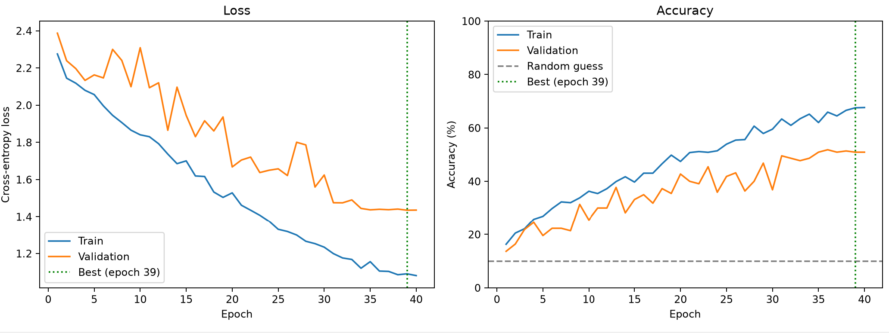
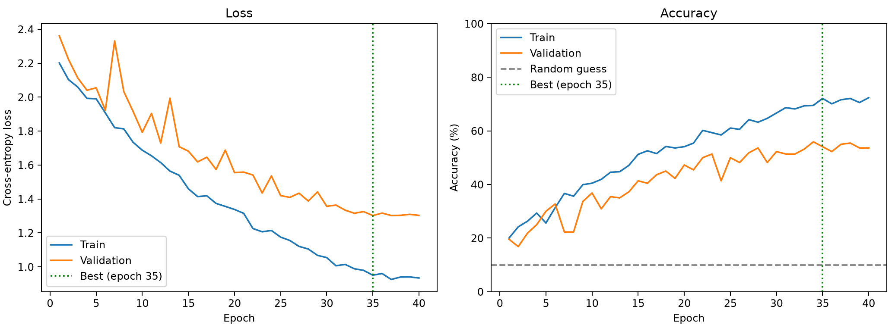

[['Beagle', 100], ['Boxer', 100], ['Bulldog', 100], ['Dachshund', 96], ['German_Shepherd', 96], ['Golden_Retriever', 91], ['Labrador_Retriever', 95], ['Poodle', 100], ['Rottweiler', 89], ['Yorkshire_Terrier', 100]]

DOG BREED CLASSIFIER
====================

[ ] 1. Explore dataset
[ ] 2. Validate dataset
[ ] 3. Visualise images
[ ] 4. Analyse image dimensions
[ ] 5. Identify potential data problems
[ ] 6. Create train/validation/test split
[ ] 7. Build image preprocessing pipeline
[ ] 8. Build Dataset/DataLoader
[ ] 9. Build basic CNN
[ ] 10. Train baseline model
[ ] 11. Plot training/validation loss
[ ] 12. Evaluate test set
[ ] 13. Create confusion matrix
[ ] 14. Investigate incorrect predictions
[ ] 15. Improve model
[ ] 16. Experiment with augmentation
[ ] 17. Experiment with architecture
[ ] 18. Test on external images
[ ] 19. Save trained model
[ ] 20. Build simple application

Val accuracy roughly equal 20% but decreasing each epoch:

One problem - model does well with training data but as training accuracy goes to 100%, validation accuracy decreases.
this is because the model is memorizing the images and not learning them.

Potential causes - all parameters on final layer of network

each feature looks at small area of pixels, meaning model might be able to see a section of eye for example, but not big enough to distinguish a head or ear

only 150 images per dog and when dog breed look as similar as they do this can cause issues

FIXES:

augments the input images - by changing the images each epoch the model is seeing the exact same pixels, making it harder for it to purely memorise every single training image

global average pool instead of one bit flattening layer - instead of flattening huge map, average all 64 channels and use nn.linear to convert to 10 values. This removes most of the models ability to memorize and will generalise the features findings more.

add more conv->pool blocks, each block expands the models range of view, allowing it to distinguish between bigger features in the image

 Experiment   │ Best val acc │ Epoch of best val loss │ Train/val gap │   Notes   │
├────────────────┼──────────────┼────────────────────────┼───────────────┼───────────┤
│ Baseline       │ 21.8%        │ 3                      │ huge          │ memorises │
├────────────────┼──────────────┼────────────────────────┼───────────────┼───────────┤
│ + augmentation │ 24.1         │ 13                     │ small(10)     │ learns    │
├────────────────┼──────────────┼────────────────────────┼───────────────┼───────────┤
│ + GAP + deeper │ 36.8%        │ 39                     │ small(5)      │

What changed in the code

- DogCNN now has 4 conv→ReLU→pool blocks (conv3: 64→128, conv4: 128→256).
- Flatten → Linear(87,616 → 10) was replaced with AdaptiveAvgPool2d(1) → Flatten → Linear(256 → 10).
- NUM_EPOCHS went from 15 to 40, because a model that can't memorise learns more slowly.

Why max pooling? It keeps the strongest signal in each window. If a filter detects "eye," it doesn't matter which of the 4 pixels the eye fell on, so the network gets a little tolerance for small shifts. It also has zero parameters.

5. Shapes through your model

┌─────────────────────┬──────────────────────────┬──────────────────────┐
│        Layer        │ Output shape (C × H × W) │ Values in the output │
├─────────────────────┼──────────────────────────┼──────────────────────┤
│ input               │ 3 × 150 × 150            │ 67,500               │
├─────────────────────┼──────────────────────────┼──────────────────────┤
│ conv1 → relu → pool │ 32 × 75 × 75             │ 180,000              │
├─────────────────────┼──────────────────────────┼──────────────────────┤
│ conv2 → relu → pool │ 64 × 37 × 37             │ 87,616               │
├─────────────────────┼──────────────────────────┼──────────────────────┤
│ conv3 → relu → pool │ 128 × 18 × 18            │ 41,472               │
├─────────────────────┼──────────────────────────┼──────────────────────┤
│ conv4 → relu → pool │ 256 × 9 × 9              │ 20,736               │
├─────────────────────┼──────────────────────────┼──────────────────────┤
│ global_pool         │ 256 × 1 × 1              │ 256                  │
├─────────────────────┼──────────────────────────┼──────────────────────┤
│ flatten             │ 256                      │ 256                  │
├─────────────────────┼──────────────────────────┼──────────────────────┤
│ fc                  │ 10                       │ 10                   │

   -- model after image augmentation

┌──────────────────────┬──────────────────────────────┬──────────────────────────────────────────┐
│                      │ 2-block model + augmentation │ 4 blocks + global pooling + augmentation │
├──────────────────────┼──────────────────────────────┼──────────────────────────────────────────┤
│ Epochs               │ 15                           │ 40                                       │
├──────────────────────┼──────────────────────────────┼──────────────────────────────────────────┤
│ Train acc at end     │ 38.1%                        │ 38.6%                                    │
├──────────────────────┼──────────────────────────────┼──────────────────────────────────────────┤
│ Val acc at end       │ 21.4%                        │ 33.6%                                    │
├──────────────────────┼──────────────────────────────┼──────────────────────────────────────────┤
│ Best val acc         │ 24.1%                        │ 36.8% (epoch 39)                         │
├──────────────────────┼──────────────────────────────┼──────────────────────────────────────────┤
│ Lowest val loss      │ 2.186                        │ 1.889 (epoch 36)                         │
├──────────────────────┼──────────────────────────────┼──────────────────────────────────────────┤
│ Train/val gap at end │ ~17 pts                      │ ~5 pts                                   │
└──────────────────────┴──────────────────────────────┴──────────────────────────────────────────┘

now adding on batchnorm:

Part 1: How batch normalisation works

The problem it solves

Your step 1 run showed it: epochs 1–2 sat at a loss of 2.303 (pure guessing), and validation loss didn't clearly drop until about epoch 15.

The cause is how the size of values changes as they pass through layers. Each conv multiplies its input by weights and adds the results. Depending on those random starting weights, a layer's outputs can come out much bigger, much smaller, or shifted off-centre compared with its inputs. With 4 layers stacked, those effects multiply:
- Values drift too far negative: ReLU (max(0, x)) turns most of them to 0. Those neurons output nothing and pass back no gradient, so they barely learn.
- Values get too large or too small: gradients become too big or too small, and training creeps or bounces around.
- The target keeps moving: every time conv1's weights update, the range of values conv2 receives changes, so conv2 is always adjusting to a new input. This is sometimes called "internal covariate shift." Researchers still debate how much it matters, but the practical benefit of BatchNorm is well established.

BatchNorm fixes this by rescaling each channel's values to a standard range after every conv, so the next layer always gets well-behaved input.

big problems in this one^^  - validation performance was very jumpy, despite training performance steadily increasing.

one possible cause is the fact that the learning rate is fixed at 0.01 meaning that even though the model may be approaching in the right direction in the final bit of training, one big change can set it off track. so we can vary this learning rate and reduce it gradually to stop this error.

Another way to improve it is to save the best model each time, as in this case the best model occured at epoch 31/40 so taking epoch 40's version as the final product will be leaving out a better option.

here is the result

it worked better and managed to achieved a loss of 1.481 at epoch 38/40 whilst maintaining a smooth descent and the model that was saved was epoch 38 not 40 as my changes hoped.

now changing the normalisation at the start so each channel (R,G,B) has mean 0 and standard deviation 1, shouldnt have a huge effect because batch normalisation layer achieves this after first block but is good practice

 loss 1.435 and 50.9% accuracy

now adding dropout to force features in training to search for stronger more meaningful relationship, also increasing epoch count as this may mean the model requires longer to learn.

dropout resulted in slightly worse best loss despite having 60 epochs rather than 40, so Ive chosen to try to crop all the images before training as the dataset comes with predetermined bounding boxes. this will mean all new images passed into the model will have to be cropped too but I think that will be achieveable with an object detection model

 good results from this achieved loss of 1.302 with best accuracy 55.5%

next steps:

1. Stronger augmentation (best value for the time). Your current set is mild: ±12px shifts, flips, ±20% brightness. With a 20-point gap, it's worth more:
- Scale jitter: crop a random 60–100% of the image and resize back to 150. This is RandomResizedCrop, the single most effective augmentation for this kind of task, and it also teaches the model that dogs come at different sizes, partly making up for the size clue that cropping removed.
- Small rotations (±15°).
- Mild colour jitter on saturation and contrast (leave hue alone, since coat colour matters).

Same epoch time, and it targets the gap directly.

2. Label smoothing: a one-line change. nn.CrossEntropyLoss(label_smoothing=0.1) asks the model to aim for 90% confidence rather than 100%. With genuinely confusable pairs like Beagle and Basset, demanding total confidence pushes the model to latch onto unreliable details. It usually gives a small, cheap gain on fine-grained problems.

3. Weight decay: switch Adam to AdamW(..., weight_decay=1e-4). Another small, cheap regulariser.

 resulted in much worse results.